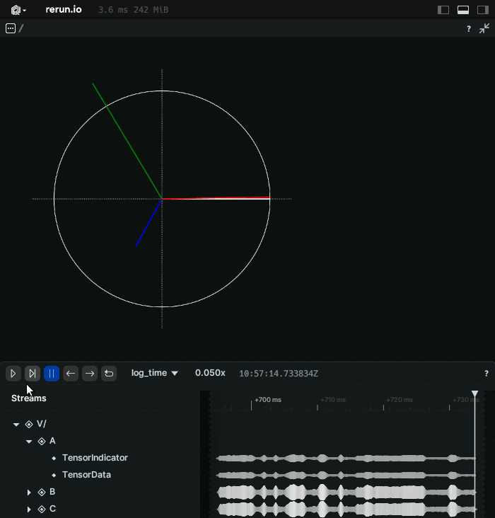

# Rerun Custom Tensor Visualization Space View

Add custom visualizations to tensors with templated SVGs

Note: This is a WIP- changes are likely, please see the next TODO section below



## Features
- SVG Templates using [Tera](https://keats.github.io/tera/)
```rust
rec.log_static("/V", &TensorViz::new_svg(svg_file)).unwrap();

...

let data = Array::from_shape_vec((1, 2), vec![mag, phase]).unwrap();
                rec.log(
                    path[i],
                    &Tensor::try_from(data)
                        .unwrap()
                        .with_dim_names(["phasor", "data"]),
                )
```

SVG Template:

```svg
<line x1="0" y1="0" x2="{{ __V__A.__phasor0__data.1 | cos * __V__A.__phasor0__data.0  }}" y2="{{ __V__A.__phasor0__data.1 | sin * __V__A.__phasor0__data.0 }}" stroke="red" stroke-width="0.01" />
```


## Next TODO (Please feel free to give feedback or contribute)

- Move Tensorviz archetype to a ViewContextSystem with an id similar to class context, and spawn heuristics for each id
- Add a tensor data based archetype, with an added id to target a context
